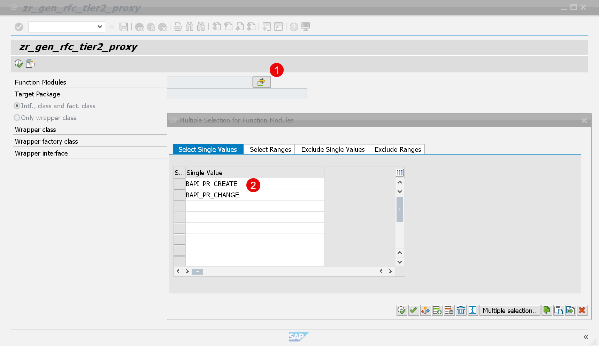
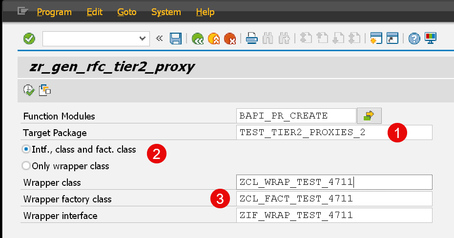
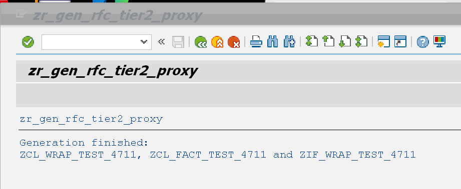
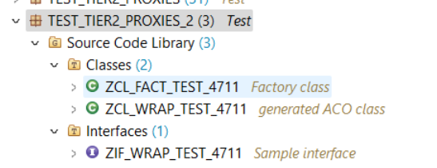

# Tier2 RFC proxy generator

This repository contains a helper class and a report that helps you to generate a custom wrapper for the ABAP Cloud enablement of an non-released RFC based SAP API.  

It basically automates several of the steps described in this repository [RAP640 - Using ABAP Cloud to Build Extensions for SAP S/4HANA Cloud, Private Edition - Mitigating Missing Released SAP APIs in the 3-tier Extensibility Model](https://github.com/SAP-samples/abap-platform-rap640/tree/main).   

## Description

The tool can be used in short as follows:

1. Start report **zr_gen_rfc_tier2_proxy** using transaction **SE38**.
2. Select one or more function modules that shall be wrapped for the use in ABAP Cloud.

      

3. Select remaining parameters

      

   3.1 **Target Package** : Here you have to select the package in which the wrapper objects shall be generated
    
   3.2 **Intf., class and fact.class**: When you select this option the generator will generate a wrapper class, an interface and a factory class (this is recommended)
       **Only wrapper class**: When you select this option the generator will only generate a wrapper class, for those that do not want to generate 3 wrapper objects
   3.3 Here you have to specify the repository object names that shall be generated. Depending on the option you have chosen you have to specify the names of three objects or just for one class.

4. Start the report and check the output.  

       

5. Check the generated objects in the target package.

      

### Background

This report uses under the hood the API's that are used by transaction ACO_PROXY.

## Further information

- [ABAP Cloud - How to mitigate missing released SAP APIs in SAP S/4HANA Cloud, private edition and SAP S/4HANA – The new ABAP Cloud API enablement guide](https://community.sap.com/t5/enterprise-resource-planning-blogs-by-sap/abap-cloud-how-to-mitigate-missing-released-sap-apis-in-sap-s-4hana-cloud/ba-p/13561479)

- [ABAP Cloud – Mitigate missing released SAP APIs in the 3-tier extensibility model: a tutorial how to wrap a BAPI and integrate it into a custom RAP business object](https://community.sap.com/t5/enterprise-resource-planning-blogs-by-sap/abap-cloud-mitigate-missing-released-sap-apis-in-the-3-tier-extensibility/ba-p/13580268)

## Requirements

- You have to have a system based on SAP S/4HANA 2022 on premise.
- You have to have enabled Developer extensibility
- You have to apply the following notes
  - [SAP Note 3444292 - ACO Proxy creates unnecessary shadow types](https://me.sap.com/notes/3444292)
  - [SAP Note 3457580 - SAP ACO - Duplicate Types for Table Parameters](https://me.sap.com/notes/3457580)

## Download and Installation

## Known Issues
No known issues. 

## How to obtain support
[Create an issue](https://github.com/SAP-samples/tier2-rfc-proxy/issues) in this repository if you find a bug or have questions about the content.
 
For additional support, [ask a question in SAP Community](https://answers.sap.com/questions/ask.html).

## Contributing
If you wish to contribute code, offer fixes or improvements, please send a pull request. Due to legal reasons, contributors will be asked to accept a DCO when they create the first pull request to this project. This happens in an automated fashion during the submission process. SAP uses [the standard DCO text of the Linux Foundation](https://developercertificate.org/).

## License
Copyright (c) 2024 SAP SE or an SAP affiliate company. All rights reserved. This project is licensed under the Apache Software License, version 2.0 except as noted otherwise in the [LICENSE](LICENSE) file.
